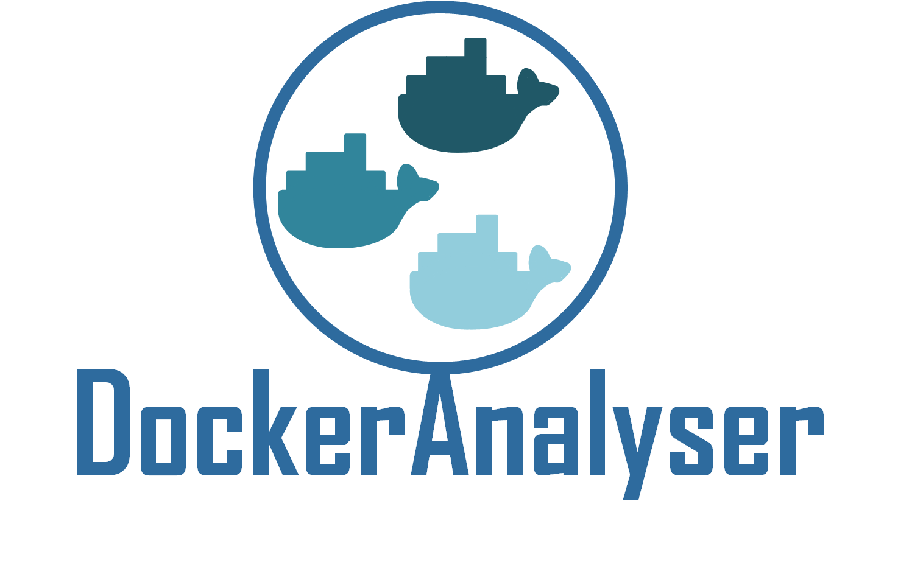
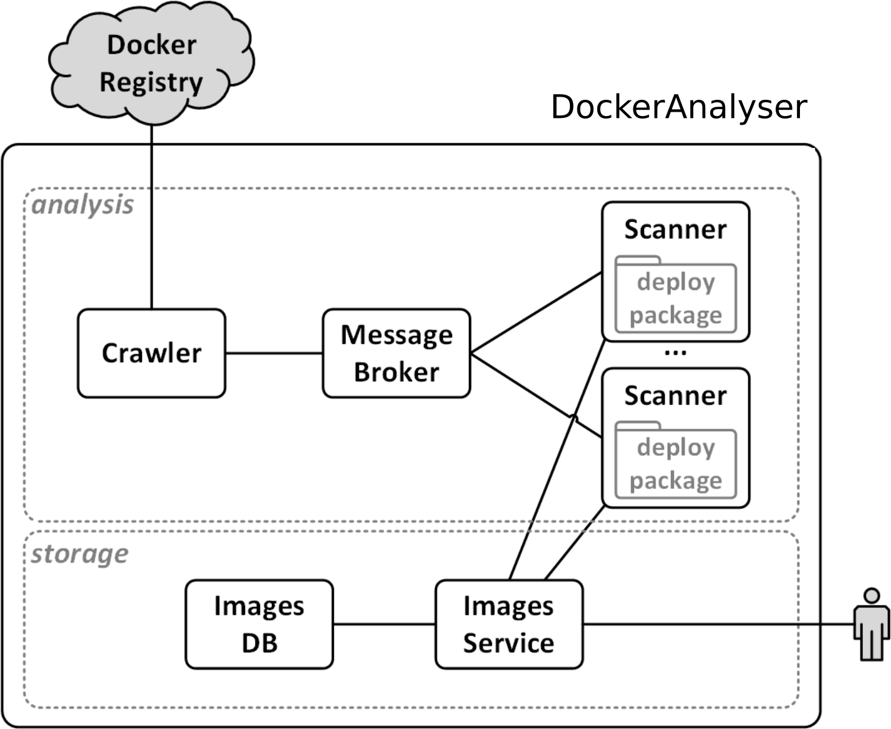

<p align="center">
  
</p>

-------

> Author: Davide Neri. <br>
> [Department of Computer Science, University of Pisa](https://www.di.unipi.it/en/)  <br>
> Contact: davide.neri@di.unipi.it

It was first presented in
> _A. Brogi, D. Neri, J. Soldani <br>
> **A microservice‐based architecture for (customisable) analyses of Docker images.** <br>
> Software: Practice and Experience, DOI: 10.1002/spe.2583. [In press]_

If you wish to reuse the tool or the sources contained in this repository, please properly cite the above mentioned paper. Below you can find the BibTex reference:
```
@article{docker-analyser,
   author = {Brogi Antonio and Neri Davide and Soldani Jacopo},
   title = {A microservice‐based architecture for (customisable) analyses of Docker images},
   journal = {Software: Practice and Experience},
   doi = {10.1002/spe.2583},
   url = {https://onlinelibrary.wiley.com/doi/abs/10.1002/spe.2583},
   note = {{\em [In press]}}
}
```


## DockerAnalyser: what is ?

`DockerAnalyser` is a microservice-based tool that permits building analysers of Docker images.

<!--
DockerAnalyser (figure below) is designed to
 - *Crawl*  Docker images from a remote Docker registry (e.g. Docker Hub),
 - *Analyse* each Docker image by running a **custom** analysis function,
 - *Store* the results into a local database. -->

<!-- <div align="center">
  
</div> -->

<!--
##### The microservice-based architecture of DockerAnalyser -->
The microservices composing the architecture are:
 - **Crawler**: crawls the *names*  of the Docker images to be analysed from a remote Docker registry (DockerHub).
 - **RabbitMQ**: is a Message Broker that store the names of the images to be analysed (sent by the Crawler) into a messages queue, and it permits the Scanners to retrieve them.
 - **Scanner**: retrieves the name of the images from the Message Broker, and for each name received it runs an *analysis function* that analyse the Docker image (stored into a **deploy-package**).
 - **ImagesService** and **ImagesDB**: is the microservice that store the obtained image descriptions into a local storage.  *ImagesService* exposes the APIs while *ImagesDB* is a NOsql database.

 <div align="center">
  
 </div>


#### deploy-package
A deploy package is a folder containing the
-  the *analysis.py* file that contains the code of the custom analysis function,
- the *requirements.txt* file that contains the Python library dependencies
- any other file needed by the analysis function (eg, configuration files).

A new analyser is built by  replacing the  *analysis analysis* function (contained in the *deploy package*) in the *scanner* microservice.

<!-- The architecture is equipped with a `docker-compose.yml` file allows to run the applicatio as a multi-container Docker application.
 -->

## DockerAnalyser: Getting started
 DockerAnalyser permits creating new Docker images analysers by using  two different options:

- [DockerAnalyser UI](#dockeranalyser-ui): using a Web based user interface (recommended for not expert users).
- [docker-compose](#docker-compose): using the docker-compose command line tool.

### Run DockerAnalyser using a web interface
(#dockeranalyser-ui)
DockerAnalyser is equipped with a web based user interface.

In order to run the UI, dowload the repository
```
git clone https://github.com/di-unipi-socc/DockerAnalyser.git
cd dockeranalyser-ui
```

Create and activate virtualenv:
```sh
virtualenv -p python3 venv
source venv/bin/activate
```

Install dependecies:
```sh
pip install --upgrade pip
pip install -r requirements.txt
```

Setup Django:
```sh
cd DockerAnalyser
python manage.py migrate
```

Collect the frontend static files:
```sh
python manage.py collectstatic --noinput
```

Enter in the frontend folder and compile the javscript file

```sh
cd frontend
npm install
npm run build
```

Start Django:
```sh
python manage.py runserver 0.0.0.0:8000

```

Dockeranalyser-ui is running on  http://localhost:8000


### Run DockerAnalyser with docker-compose
(#docker-compose)
Tis guide assume that you know how to use (*docker-compose*)[https://docs.docker.com/compose/]

The steps needed to create an *analyser* with *docker-compose* are the following:
1. Clone the [GitHub ](https://github.com/di-unipi-socc/DockerAnalyser.git) repository of DockerAnlyser locally.
```
git clone https://github.com/di-unipi-socc/DockerAnalyser.git
```
2. Create a the **deploy package** folder (or exploit the two  [examples](./dockeranalyser/data/examples/README.md)) and inside the created folder create the following files:
  -  The **analysis.py** file that contains the code of the custom analysis function,
  - The **requirements.txt** file that contains the Python library dependencies,
  - Any other file needed by the analysis function (e.g., configuration files)
3. Build the Scanner Docker image with  [Docker Compose](https://docs.docker.com/compose/install/) by running the command below (where *F* is the
name of the deploy folder *F* created at step 2.)
```
docker-compose build --build-arg deploy=<F> scanner
```
4. Start the analyser using `docker-compose`
```
docker-compose up -d
```
Two use cases (DockerFinder and DockerGraph) can be found in the  [examples](./dockeranalyser/data/examples/README.md) folder.

#### How to retrieve the images descriptions
DockerAnalyser is equipped with a python script that interacts with the *ImagesService* and allow to: *download* the description of the images (in a JSON file), *upload* the images, *remove* all the images, and *get* a single image.

1. Install the library dependencies
  ```
  cd storage && pip install -r requirements.txt
  ```
2. Run the script `ImagesManager.py`

  ```
  python ImagesManager.py

  Usage:
    ImagesManager.py download  [--file=<images.json>] [--images-url=<http://127.0.0.1:3000/api/images>]
    ImagesManager.py upload [--file=<images.json>] [--images-url=<http://127.0.0.1:3000/api/images>]
    ImagesManager.py rm    [--images-url=<http://127.0.0.1:3000/api/images>]
    ImagesManager.py get [--name=<name>]    [--images-url=<http://127.0.0.1:3000/api/images>]
    ImagesManager.py (-h | --help)
    ImagesManager.py --version

  ```
