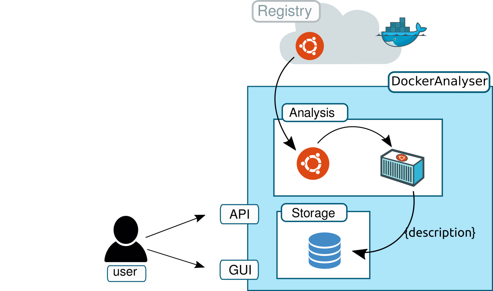

#  DockerAnalyser

[Department of Computer Science, University of Pisa](https://www.di.unipi.it/en/)

Author: Davide Neri.

Contact: davide.neri@di.unipi.it


> `DockerAnalyser` is a microservice-based tool that permits building analysers of Docker images.


## DockerAnalyser: high level overview

DockerAnalyser (figure below) is designed to
 - crawl Docker images from a remote Docker registry (e.g. Docker Hub),
 - analyse each image by running an analysis function, and
 - store the results into a local database.

<div align="center">
  
</div>

### The microservice-based architecture of DockerAnalyser
DockerAnalyser has a microservice-based architecture (figure below).
The microservices composing tha architecture are:
 - **crawler**: crawls the Docker image *names* to be analysed from a remote Docker registry.
 - **rabbitMQ**: is a Message Broker that store the names of the images to be analysed (from the Crawler) into a messages queue, and it permits the Scanners to retrieve them.
 - **scanner**: retrieves the name of the images from the Message Broker, and for each name received it runs an *analysis function*.
 - **ImagesService** and **ImagesDB**: is the microservice that store the obtained image descriptions into a local storage.  *ImagesService* exposes the APIs while *ImagesDB* is a NOsql database.

The architecture is equipped with a `docker-compose.yml` file allows to run the applicatio as a multi-container Docker application.

 <div align="center">
 
 </div>

## How to create a new Docker image analyser
> Users can build their own image analysers by replacing the  *analysis analysis* function (contained in the **deploy package**)  executed by the *scanner* microservice.

The steps needed to create an **analyser** starting from DockerAnalyser are the following:
1. Clone the [GitHub ](https://github.com/di-unipi-socc/DockerAnalyser.git) repository of DockerAnlyser locally.
```
git clone https://github.com/di-unipi-socc/DockerAnalyser.git
```
2. Create a folder *F* (that represents the **deploy package**) and inside the created folder
create the following files:
  -  The *analysis.py* file that contains the code of the custom analysis function,
  - The *requirements.txt* file that contains the Python library dependencies,
  - Any other file needed by the analysis function (e.g., configuration files)
3. Build the Scanner Docker image with  [Docker Compose](https://docs.docker.com/compose/install/) by running the command below (where *F* is the
name of the deploy folder *F* created at step 2.)
```
docker-compose build --build-arg deploy=<F> scanner
```
4. Start the analyser using `docker-compose`
```
docker-compose up -d
```
Two use cases (DockerFinder and DockerGraph) can be found in the  [examples](./data/examples/README.md) folder.

#### How to retrieve the images descriptions
DockerAnalyser is equipped with a python script that interacts with the *ImagesService* and allow to: *download* the description of the images (in a JSON file), *upload* the images, *remove* all the images, and *get* a single image.

1. Install the library dependencies
  ```
  cd storage && pip install -r requirements.txt
  ```
2. Run the script `ImagesManager.py`

  ```
  python ImagesManager.py

  Usage:
    ImagesManager.py download  [--file=<images.json>] [--images-url=<http://127.0.0.1:3000/api/images>]
    ImagesManager.py upload [--file=<images.json>] [--images-url=<http://127.0.0.1:3000/api/images>]
    ImagesManager.py rm    [--images-url=<http://127.0.0.1:3000/api/images>]
    ImagesManager.py get [--name=<name>]    [--images-url=<http://127.0.0.1:3000/api/images>]
    ImagesManager.py (-h | --help)
    ImagesManager.py --version

  ```
